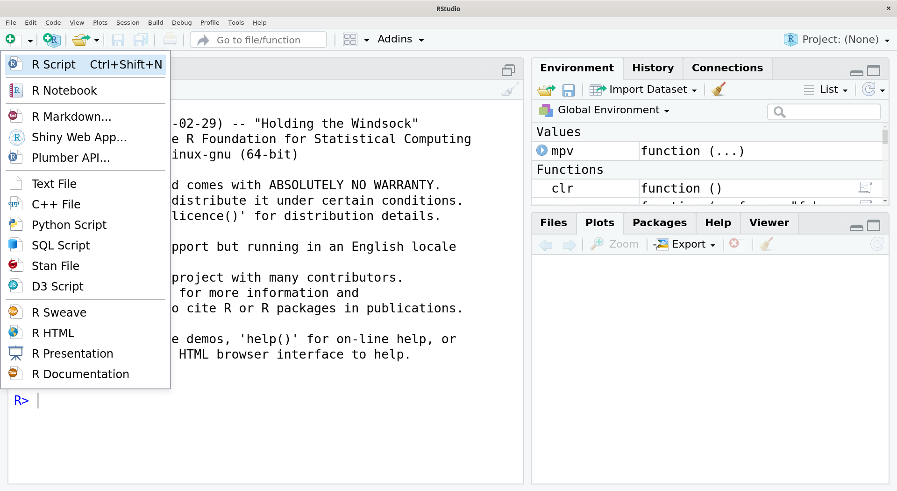
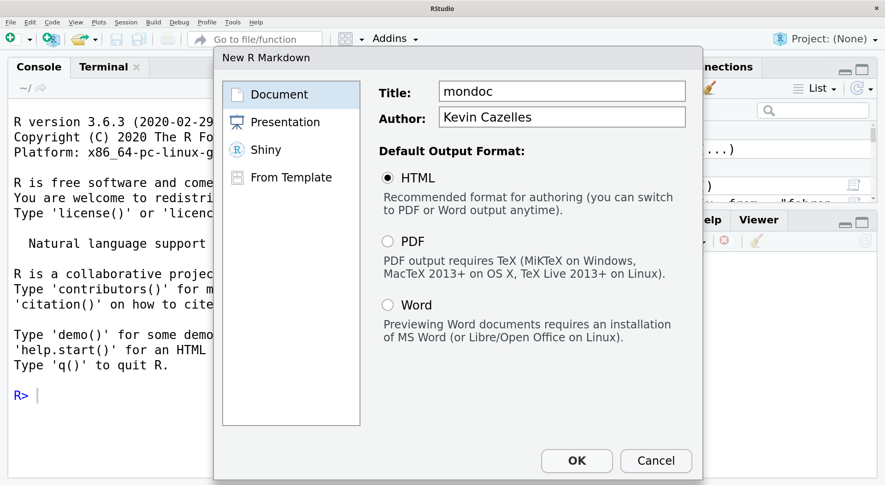
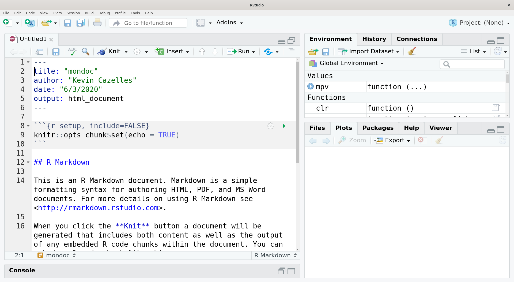

# Avant-propos

Ce document est une introduction à R Markdown conçu pour répondre aux objectifs suivants:

1. comprendre ce qu'est R Markdown;
2. comprendre les liens entre R, Markdown et Pandoc;
3. apprendre la syntaxe Pandoc Markdown;
4. apprendre à créer des documents dynamiques avec le package `rmarkdown`.

Ce document a lui-même été édité avec R Markdown et peut-être converti en une
page internet (format HTML, `.html`), au format Word (`.docx`) ou encore en
document portable (`.pdf`). Bien que dans "R Markdown", il y ait "R" et
"Markdown", ce document n'est pas une introduction à R
(<http://www.r-project.org>). Bien que le contenu est accessible aux utilisateurs débutants, pour les lecteurs intéressés qui ne connaissent pas encore R, une courte introduction à R est nécessaire. Ils pourront consulter l'une des différentes introductions disponibles sur le site du CRAN:
<https://cran.r-project.org/other-docs.html>.

Ce document est déployé automatiquement par GitHub Actions (voir
<https://github.com/KevCaz/Rmarkdowndocfr/actions>), lors de la dernière
compilation, la version `r packageVersion("rmarkdown")` du package `rmarkdown`
a été utilisée. De plus amples informations relatives à l'environnement dans
lequel le document a été compilé sont indiquées ci-dessous.


<details>
```{r sesinfo}
sessionInfo()
rmarkdown::pandoc_version()
```
</details>


```{r extfun, include = FALSE}
source("scripts/zzz.R", local = knitr::knit_global())
```


# Introduction

Dans de nombreux milieux professionnels, à des fins de communication diverses,
sont produits régulièrement des documents intégrant des analyses de données
(tableaux, figures, tests statistiques, etc.). Pour créer de tels documents, il
faut être en mesure de manipuler des données les analyser et créer des figures
pour les intégrer dans le document final. [R](http://www.r-project.org) est un
langage de programmation qui répond à ces besoins avec un grand nombre de
package qui permettent de manipuler et traiter un spectre très large de données
et de les visualiser efficacement. Ce langage offre également la possibilité
d'intégrer code et les produits du code (résultats de tests, tableaux, figures,
etc.) directement dans un document qui est alors qualifié de dynamique. Le
package le plus utilisé pour créer des documents dynamiques est la package
`rmarkdown` l'intégration de R dans un document écrit avec Markdown et qui peut
être converti en de nombreux formats de document (dont PDF, word, HTML). C'est
ce package qui est l'objet de ce document, bien qu'il nous faudra en mentionner
d'autres ainsi que d'autres langages et outils pour comprendre ce package, en
commençant par Markdown.

Markdown est un langage de balisage léger, c'est-à-dire un langage dans lequel on peut utiliser des ensembles de caractères spécifiques (des balises) pour délimiter une zone de texte pour laquelle un formatage associé (e.g. **text en gras**) est appliqué. Markdown est aujourd'hui très répandu sur Internet, à tel point que vous pourriez une des différentes syntaxes existantes sans me le savoir. Sans être exhaustif, il est utile de donner un peu plus de détails sur ce point pour bien comprendre ce quel Markdown on utilise avec R Markdown. La syntaxe originale de Markdown est le fruit du travail de John Gruber[^wiki_gruber], programmeur, blogueur et baladodiffuseur de Philadelphie en collaboration avec Aaron Swartz (lui même connu pour avoir participer a la création de Creative Commons et son tragique destin qui fut l'objet d'un film). Sur le site de John Gruber, "daringfireball", Markdown est décrit depuis décembre 2004 et on peut même y télécharger la version 1.0.1 (voir <http://daringfireball.net/projects/markdown>). L'idée de départ est simple et élégante&nbsp;: produire un langage léger qui simplifie les balises HTML (utilisé par tout les sites Internet). L'idée n'est pas tant de remplacer le HTML mais plutôt d'en augmenter l'efficacité d'écriture et de fait, il est beaucoup plus rapide d'écrire en Markdown qui couvre les opérations de formatage les plus courantes (listes, hyperliens, etc.). Notons qu'il existe d'autres langages qui répondent aux mêmes objectifs, par example ReStructuredText[^wiki_rst]. 

Après la publication de Markdown, John Gruber a cessé de travailler sur
Markdown[^blog_badparent] et d'autres développeurs, sans doute séduits par le
langage, ont proposé différentes additions syntaxiques. Il s'agissait surtout de
lever certaines limitations tout en préservant l'esprit d'origine. Voici une liste non exhaustive de différentes variantes Markdown:

 - [GitHub Flavored Markdown (GFM)](https://help.github.com/articles/github-flavored-markdown/)
 - [Kramdown](http://kramdown.gettalong.org/syntax.HTML#math-blocks)
 - [Markdown Extra](https://michelf.ca/projects/php-markdown/extra/)
 - [Multi Markdow](https://github.com/fletcher/MultiMarkdown/wiki/MultiMarkdown-Syntax-Guide#math-support)
 - [Pandoc Markdown](http://pandoc.org/README.HTML#pandocs-markdown)

Fort heureusement, depuis 2014, CommonMark (<https://commonmark.org/>) propose
une spécification (norme technique) pour Markdown de plus en plus
utilisée[^goldmark], ce qui signifie qu'en allant d'un outil à l'autre qui
utilise cette spécification, il n'y a pas de questions à se poser quant à savoir
ce qui marche ou non en terme de syntaxe (un problème parfois frustrant quand on
utilise plusieurs outils qui utilisent différentes syntaxes Markdown), il
suffit de se reporter à la spécification!


Il est important de souligner que R Markdown (voir
<http://rmarkdown.rstudio.com>)[^1] utilise [la variante Markdown de
Pandoc](https://rmarkdown.rstudio.com/lesson-8.html)[^2]. Une précision relative
à Pandoc (<http://www.pandoc.org>) s'impose: il s'agit, comme l'indique le site
internet, d'un "convertisseur de document universel", en une ligne de commande
Pandoc convertit un document dans un format donné en un document d'un autre
format. Par exemple, Pandoc permet de passer d'un fichier `.tex` (LaTeX) à un
fichier `.docx` (Word)! La variante Markdown de Pandoc a été pensée pour rester
fidèle à l'esprit originel de Markdown tout en incluant davantage d'éléments de
document communs différent format de documents[^pmd]. Pour rendre le document
dynamique, R Markdown utilise les fonctionnalités de [`knitr`](http://cran.r-project.org/web/packages/knitr/index.html) qui
intègre du code R et ce qu'il produit. Le document dynamique en question pourra
être converti dans un grand nombre de format grâce à l'utilisation de
[Pandoc](http://www.pandoc.org/installing.html). Les intérêts de R Markdown sont
nombreux :

1. utiliser une syntaxe épurée pour distinguer la mise en page, le texte, le formatage du texte et le code R,
2. utiliser les fonctionnalités du package `knitr` pour créer morceaux de codes, tableaux et figures dynamiquement,
3. utiliser le format de sérialisation YAML pour personnaliser la mise en page des documents produits grâce à la fonction `render()`, elle-même appelée en quelques clics avec [RStudio](http://www.rstudio.com),
4. obtenir ainsi un document avec un contenu R dynamique en différents formats dont HTML (fichier `.html`), PDF (`.pdf`) et Word (`.docx`).

Il existe une documentation abondante relative à R Markdown, malheureusement pour ceux qui ne pratiquent pas la langue de Shakespeare, cette documentation est presque exclusivement écrite en anglais. Pour les lecteurs capables de lire l'anglais, je recommande [le site officiel de R Markdown](https://rmarkdown.rstudio.com) sur lequel vous trouverez, entre autres, un condensé d'utilisation sous forme de *Cheat Sheet*, voir <http://www.rstudio.com/wp-content/uploads/2015/02/rmarkdown-cheatsheet.pdf>. Aussi, sur le site <https://bookdown.org> vous trouverez un livre en anglais très complet sur le sujet, par l'un des architectes de R Markdown, Yihui Xie, <https://bookdown.org/yihui/rmarkdown/> ainsi qu'un [livre d'astuces (*cook book*)](https://bookdown.org/yihui/rmarkdown-cookbook/).

Une section complète du site de l'auteur principal de `knitr`, Yihui Xie, lui encore, <http://yihui.name/knitr/>, permet de bien comprendre l'intégration des morceaux de code et des résultats de ce code, contenu qui fait l'objet d'un livre de ce même auteur [@xie_dynamic_2017]. Je tiens également à signaler la [présentation de Mansun Kuo sur Rpubs](http://rpubs.com/mansun_kuo/24330). Pour apprendre la syntaxe Pandoc Markdown, vous pouvez vous reportez à la très complète page internet écrite en français par Jean-Daniel Bonjour, <http://enacit1.epfl.ch/markdown-pandoc>.

La syntaxe [Pandoc
Markdown](http://rmarkdown.rstudio.com/authoring_pandoc_markdown.html) est, à
mon sens, très complète, mais elle ne permet pas une personnalisation totale de
la mise en page de votre document. Il existe des moyens simples pour aller plus
loin avec R Markdown, détaillé dans le livre d'astuces mentionné ci-dessus. Si
toutefois vous souhaitez aller encore plus loin dans la mise en forme de votre
document, vous pouvez utiliser une des trois approches suggérez ci-dessous.
Néanmoins, avant d'envisager l'un de ces recours, il est très important de se
demander si cette personnalisation est nécessaire.

1. vous pouvez travailler sur le document dans le format qui vous intéresse après l'avoir générer, c'est une solution qui a une limite évident: à chaque fois que le document sera compilé, les modifications post-compilation seront perdues,
2. vous pouvez utiliser un *template* personnel[^template], un fichier qui gère partie la mise en forme de votre document) associé à votre document,
3. vous pouvez toujours composé en un langage donné, p. ex. [HTML](http://www.w3.org/html/) ou [Latex](http://www.latex-project.org), mais les commandes non valides pour un format donné, seront ignorées.


<!-- Pourrait faire l'objet de development future -->

Avant de rentrer dans le vif du sujet, je souhaiterais insister sur le fait que
cette introduction est axée sur la création de document en format Word, PDF et
HTML pour de nombreux usages (rapport, article, etc.), mais que les possibilités
offertes par `rmarkdown` sont plus vastes (voir le site dédié
<http://rmarkdown.rstudio.com>), entre autres

- pour les documents&nbsp;:
    - [PDF](https://en.wikipedia.org/wiki/Portable_Document_Format)
    - [HTML](http://rmarkdown.rstudio.com/html_document_format.html)
    - [Word](http://rmarkdown.rstudio.com/word_document_format.html)
    - [Tufte handout (Pdf)](http://rmarkdown.rstudio.com/tufte_handout_format.html)
    - [Package Vignette (Html)](http://rmarkdown.rstudio.com/package_vignette_format.html)
- pour les présentations&nbsp;:
    - [Beamer](http://rmarkdown.rstudio.com/beamer_presentation_format.html)
    - [ioslide](http://rmarkdown.rstudio.com/ioslides_presentation_format.html)
    - [Slidy](http://rmarkdown.rstudio.com/slidy_presentation_format.html)

De plus, il existe des packages qui se basent sur `rmarkdown` et en étendent les
applications. Par exemple, `blogdown` vous permet d'écrire des postes de blogue
avec R Markdown dans un site permet généré par Hugo (<https://gohugo.io/>).  De
même, avec bookdown (<https://bookdown.org/yihui/bookdown/>), vous pouvez
créer de long documents HTML structurés comme un
[Gitbook](https://www.gitbook.com). Ainsi, les fonctionnalités décrites dans ce
document permettent d'utiliser une très grande variété de médias pour partager
les fruits de votre labeur.

<!-- Cette
possibilité offerte depuis très longtemps avec la fonction `Sweave()` (package
de base `utils`) qui permet de remplacer du code R par son rendu. Mais la
véritable force vient des travaux de Yihui Xie avec le package
[`knitr`](http://cran.r-project.org/web/packages/knitr/index.html) (voir
<https://yihui.org/knitr/>), qui utilise cette fonctionnalité, permet de
produire des fichiers LaTeX intégrant du code R et des figures. Le package
[`rmarkdown`](https://rmarkdown.rstudio.com/) développé par RStudio est un
package R très populaire qui a rendu la création de documents dynamiques avec R
très efficace. -->


<!-- TODO add table references sites ouvrages -->


# Utiliser un fichier R Markdown

## Organisation générale

Un fichier R Markdown (dont l’extension est `.rmd` ou `.Rmd`), c'est :

1. un document de texte plein qui utilise la variante syntaxique Pandoc de Markdown;

2. des blocs de code particuliers qui, en plus de pouvoir être utilisés pour présenter du code, le code va pouvoir être exécuter et le résultat du code va pouvoir être intégré dans le document. Ces blocs commencent et finissent trois accents graves (*backtick* ou *backquote* en anglais): \` et les trois accents graves ouvrant le bloc sont suivis d'une accolade qui commence par `r` ou `R`, par exemple


    ````markdown
    `r ''````{R name, option1, option2}
    # code R à exécuter
    ```
    ````

    ou encore

    ````markdown
    `r ''````{r option1}
    # code R à exécuter
    ```
    ````

3. enfin, un *Front Matter*[^notrad] YAML optionnel (au début du fichier, dans un bloc de trois tirets&nbsp;: \-\-\-) qui permet de donner des indications sur le ou les documents à générer.

Au début, il peut-être un peu difficile de se retrouver dans un tel fichier car
différents langages y sont utilisés, notamment

1. un langage de programmation pour les analyses, R;
2. un langage de balisage pour l'écriture du document, Markdown;
3. un langage de sérialisation de données pour spécifier les sorties du documents, YAML.

Ajoutons à cela qu'avec la variante syntaxique Pandoc de Markdown, les symboles mathématiques TeX[^wiki_TeX] (<https://pandoc.org/MANUAL.html#math>) sont utilisés pour rendre facile l'écriture, entre autres, des équations[^pm_math], en un sens c'est un quatrième langage à connaître!


## Créer un fichier R Markdown

Créer un fichier R Markdown, c'est simplement créer un fichier dont l'extension
est `.Rmd` ou `.rmd`, ce qui peut être fait avec n'importe quelle éditeur de
texte, ou de code, ou même en ligne de commande. Par example, étant moi-même
utilisateur du terminal et travaillant dans un environment Linux, j'entre dans
ce dernier la commande:

```shell
$ echo "---\nauthor: Kevin Cazelles\n---" > mondoc.Rmd
```

et le fichier est créé! Pour les utilisateurs de R Studio, cela peut se faire en
2 clics, comme illustré sur les figures qui suivent. L’intérêt d'utiliser R
Studio pour cette opération est que le fichier ainsi créé contient des
indications relatives à l'utilisation du fichier en question.









## Spécifier les documents à obtenir avec YAML

Le site officiel <https://yaml.org/> indique:

> [*Traduction*]
>
> YAML est un standard de sérialisation de données pour tous langages de programmation adopté à l'humain.


Autrement dit, dans un fichier au format YAML (extension `.yaml` ou `.yml`), on
entre des données qui pourront être utilisées dans par de nombreux langages de
programmation et ce fichier est facile à lire par l'humain. Pour que le contenu
du fichier soit effectivement utilisables dans un langage de programmation
donné, il faut que le code ad hoc soit disponible. Pour les utilisateurs de R,
c'est le package `yaml`[^ryaml] qui permet de lire de tels fichiers et de les
importer sous forme de listes.

<!-- predre qq examples simples et ajouter um fichier de lecture pour montere comment ça marche https://en.wikipedia.org/wiki/YAML -->


Pour comprendre l'essentiel du fonctionnement du YAML, je vous recommande le
tutoriel à l'URL suivante :
<https://sweetohm.net/article/introduction-yaml.html> en vous concentrant sur la
syntaxe et non sur comment utiliser Python pour le faire. De manière générale:

```yaml
nomduchamp: données
```

et on saute une ligne pour ajouter un autre champ:

```yaml
nomduchamp: données
nomduchamp2: données2
```

Un champ données peut contenir une chaîne de caractère, une date, des chiffres ou encore une liste:

```yaml
nomduchamp: [élément1, élément2]
```

ou encore

```yaml
nomduchamp:
    - élément1
    - élément2
```

Noté que l'indentation est utilisée pour signifier la hiérarchie entre les différents éléments et que les commentaires sont introduits par un "\#".


```yaml
nomduchamp:
    souchamp1: élément1
# ce qui suit sont les élément dans le 2eme souschamp
    souchamp2:
        souchamp2a: élément2a
        souchamp2b:
            - élément2ba
              élément2ba
```


Aussi, voici un exemple qui, bien que non-exhaustif, montre comment un fichier est structuré et comment l'important dans R (le fichier utilisé est disponible dans le répertoire GitHub <https://github.com/KevCaz/Rmarkdowndocfr/blob/master/assets/data_01.yaml>):


```yaml
author: Kevin Cazelles
date: 2020-06-06
description: "Il s'agit d'un exemple, utilisez les guillemets pour les longs textes avec ponctuation!"
# Les différents variables
var1: [C, C++, Dart, Julia, Python, R, Rust]
var2: y
var3:
   var3a:
      x: 1
      "y": 2
   var3b:
     - a
     - b
   var3c: |
      utiliser plusieurs
      lignes et garder les sauts de lignes
```

Pour l'importer avec le package `yaml`, j'utilise les commandes suivantes:


```{R yaml}
library(yaml)
yaml.load_file("assets/data_01.yaml")
```

Les chaînes de caractères `y`, `yes`, `true`, `TRUE` ainsi que `n`, `no`,
`false`, `FALSE` seront toutes interprétées comme variables booléennes
(respectivement `TRUE` ou `FALSE` dans R). C'est une fonctionnalité
pratique mais à double tranchant: par exemple si `y` est utilisé comme nom de
champ, le nom du champ sera interprété comme `TRUE` et pour palier ce
comportement, il faut ajouter des guillemets (voir l'exemple ci-dessus).


Les remarques précédentes sont générales et vous pourriez être amené à utiliser
YAML dans un autre contexte que l'édition de document avec R Markdown, par
exemple pour stocker des données. Revenons à l'utilisation de YAML dans un
document R Markdown. Ce qu'il faut bien garder à l'esprit, c'est que les options
utilisées servent à spécifier différents propriétés des documents à générer à
partir du fichier `.Rmd` (p-ex le titre, la date, les polices de caractères
utilisées, ajout d'une table des matières, etc.) grâce à des *templates*
utilisés par Pandoc. Ainsi, les options disponibles dépendent des templates
utilisés qui sont spécifiques à un format donné, les options par défaut varient
ainsi d'un format à l'autre. Pour un aperçu assez complet des options YAML
utilisables dans fichier R Markdown, rendez-vous à la dernière page du [guide de
référence](http://www.rstudio.com/wp-content/uploads/2015/03/rmarkdown-reference.pdf).
Notez qu'il est possible de créer ses propres templates et donc d'ajouter autant
d'options que désiré.


À titre d'exemple, ce document utilise un grand nombre d'options en voici une
reproduction quasi-identique (sans le résumé complet et sans la majorité des
commentaires que vous pouvez trouverez dans le fichier source de ce
document)&nbsp;:


```yaml
---
title: "Utiliser R Markdown pour créer des documents dynamiques"
date: "`r format(Sys.time(), '%d %B %Y')`"
author: par Kevin Cazelles
lang: fr
abstract: "Le package [...] pour aller plus loin."
fontfamily: fourier
linestretch: 1
fontsize: 10pt
lof: yes
output:
    html_document:
        toc: yes
        toc_float: yes
        highlight: default
        theme: flatly
        include:
            after_body: assets/footer.html
    PDF_document:
        highlight: tango
        toc: yes
        toc_depth: 3
        fig_caption: yes
        keep_tex: yes
        latex_engine: PDFlatex #xelatex
        number_section: yes
        includes:
            before_body: assets/license.tex
    word_document:
        #toc: yes
        fig_caption: yes
        highlight: pygments
    md_document:
        variant: markdown_strict
bibliography: assets/mybiblio.bib
csl: assets/journal-of-theoretical-biology.csl
header-includes:
    - \usepackage{fancyhdr}
    - \pagestyle{fancy}
    - \fancyfoot[CO,CE]{Documents dynamiques avec R Markdown}
    - \fancyfoot[R]{\thepage}
---
```

Comme expliqué précédemment, l’indentation est utilisée pour regrouper les options par format. Ainsi, les lignes qui se trouvent entre "pdf_document:" et "word_document:", spécifient différents aspects relatifs à la génération au format PDF. Par exemple, pour ajouter une table des matières, on ajoute `toc: yes`, "toc" signifiant *table of content* (table des matières) et pour en contrôler la profondeur (le niveau maximal des sous-titres affichés dans la table), on utilise "toc_depth".  De même, "tof" (*table of figure*) permet d'ajouter une table des figures. Aussi, l'option "number_section:true" permet d'obtenir une numérotation des différentes parties.

Avant de finir, une astuce qui peut être bien pratique, il est possible d'accéder à la liste des options passée dans l'en-tête YAML comme suit:

```{r metadata}
rmarkdown::metadata
```


<!-- https://hitchdev.com/strictyaml/ -->


## Éditer le contenu du fichier R Markdown

Pour éditer le contenu du fichier R Markdown, on utilise simplement du texte plein avec la syntaxe Pandoc Markdown (détaillée dans la section suivante), la différence avec un document Markdown est qu'il est possible d’exécuter du code R et d'utiliser les résultat du code, ce qui rend le document dynamique (voir la section dédiée plus bas).


## Obtenir le document final (ou les documents finaux)

Une fois que le fichier est prêt (ou lorsqu'on souhaite voir un aperçu de notre document) et que le package `rmarkdown` est installé[^4], on utilise la fonction `render()` du package en lui indiquant le chemin de du fichier `.Rmd`. Si on est un utilisateur de RStudio, on peut cliquer sur `Knit` dans la barre de menu contextuelle associée au fichier (voir la documentation associée, `?render`). Dans la suite du document, la fonction `render()` est utilisée:

```R
render("ex_Rmardown.rmd", output_format = "all")
```

Passer "all" au paramètre `output_format` permet d’obtenir tous les fichiers pour lesquels il existe une spécification dans le fichier YAML. Les formats utilisés ici sont&nbsp;:

- [PDF](https://bookdown.org/yihui/rmarkdown/pdf-document.html)
- [HTML](https://bookdown.org/yihui/rmarkdown/html-document.html)
- [Word](https://bookdown.org/yihui/rmarkdown/word-document.htmll)
- [Markdown](https://bookdown.org/yihui/rmarkdown/markdown-document.html)

Les documents au format PDF requièrent [l'installation de
Latex](https://www.tug.org/texlive/quickinstall.html) étant donné que pour
produire un PDF à partir d'un fichier ".rmd", un premier fichier Latex est
produit. Pour le lecteur qui désire conserver le fichier Latex utilisé pour
produire le PDF, il suffit d'ajouter l'option `keep_tex: true` dans les options
relatives au format PDF dans le Le fichier YAML. Pour le Markdown, un
fichier ".md" est généré suivant la variante de Markdown précisée dans le YAML
par `variant: markdown` (voir la section suivante). Au passage, le format "Tufte handout" (qui n'est pas utilisé ici) est une mise en page qui inclut des marges larges où sont insérées les illustrations (dont les figures) et que nous devons au chercheur Edward Tufte.


# Le variante Pandoc de Markdown


Dans cette partie, je présente les éléments de formatage du texte proposés par
la syntaxe Pandoc de Markdown. L’ensemble est très bien présenté sur le [site de
R Markdown](http://rmarkdown.rstudio.com/authoring_pandoc_markdown.html)[^noteswmk]
et très bien résumé à la première page du [guide de
référence](http://www.rstudio.com/wp-content/uploads/2015/03/rmarkdown-reference.pdf). Pour une source en français, j'ai trouvé un excellent tour d'horizon nommé&nbsp;: "Élaboration et conversion de documents avec Markdown et Pandoc" (<http://enacit1.epfl.ch/markdown-pandoc/>) écrit par Jean-Daniel Bonjour. Parmi les nombreux tutoriels plus courts sur le sujet, je recommande celui de Sarah Simpkin [@simpkin_debuter_2020] disponible en ligne à l'adresse suivante <https://programminghistorian.org/fr/lecons/debuter-avec-markdown>. 

Avant de commencer, je tiens à préciser que certains symboles sont réservés au formatage du texte. Cependant, quand leur affichage est requis, on les fait précéder du caractère d'échappement qui est l'antislash pour Markdown&nbsp;: "\\". Par exemple, j'entre&nbsp;:

    \\ \& \# \$ \[

Pour obtenir&nbsp;: \\ \& \# \$ \[. J'ajoute que certains sauts de ligne sont
obligatoires pour obtenir la mise en page désirée (pour les notes de bas de page
par exemple).


[^noteswmk]: Le site de documentation est totalement écrit en Markdown et reprend ce que nous pouvons lire sur le [site de Pandoc](http://pandoc.org/demo/example9/pandocs-markdown.html) et que je reprend mais en français!


## Décoration du texte

- Pour écrire du *texte en italique*, vous avez deux possibilités&nbsp;:

```md
*le texte à mettre en italique*
_le texte à mettre en italique_
```

- Pour écrire du **texte en gras**, encore deux possibilités&nbsp;:

```md
**le texte à mettre en gras**
__le texte à mettre en gras__
```

- Pour écrire du **_texte en gras et italique_**, utilisez&nbsp;:

```md
**le _texte en italique et en gras_**
```

- Pour obtenir un ~~texte rayé~~, entrez&nbsp;:

```md
~~texte rayé~~
```

- Pour écrire un élément en ^exposant^, utilisez&nbsp;:

```md
^texte en exposant^
```

- Pour écrire un élément en ~indice~, tapez&nbsp;:

```md
~texte en indice~
```

Notez qu'il n'y a pas de balises pour le soulignement du texte. De manière
générale, quand un élément de mise en page manque dans la syntaxe, il est
toujours possible d'utiliser des commandes d'un langage. Par exemple, pour
souligner dans un document qui sera produit en HTML, je peux utiliser `<u>texte
souligné</u>` mais cela ne me permettra pas d'avoir un texte souligné en Word ou
en PDF. De même que si j'utilise `\underline{texte souligné}` le texte sera
souligné en PDF, mais pas en HTML ni en Word. Procéder de la sorte n'est pas
toujours souhaité car le document R Markdown perd en généralité, en ce sens où
il ne pourra pas être correctement généré dans tous les formats. Cela n'est
cependant pas nécessairement un problème, par exemple, si vous souhaitez obtenir
le document en un seul format, ce fonctionnement devient un atout puisque vous
pouvez utiliser toute la gamme de mise en forme offerte par le langage en question.


## Les titres

Le plus simple est d’utiliser un nombre croissant de `#` (*ATX-Style headers* en anglais) pour descendre dans l'arborescence des titres:

```md
# Un titre d'ordre 1
## Un titre d'ordre 2
### Un titre d'ordre 3
```

Il est aussi possible d'utiliser une série de "=" en dessous des titre de
premier niveau et une ligne de "-" en dessous des titres de niveau 2 (*SETEXT-Style headers* en anglais). Cette option permet de repérer facilement les titres dans le code source.


```md
Un titre d'ordre 1
==================
Un titre d'ordre 2
------------------
### Un titre d'ordre 3
```

## Les listes

Les listes sont très intuitives en Markdown, alors qu'elles requièrent des balises un peu lourdes aussi bien en Latex qu'en HTML. Notez que dans les exemples donnés, il faut toujours séparer le texte principal de la liste par des sauts de ligne.


### Listes non numérotées

Pour obtenir une liste non numérotée j'entre&nbsp;:

```md
* objet 1,
* objet 2,
* objet 3.
```

ou bien&nbsp;:

```md
+ objet 1,
+ objet 2,
+ objet 3.
```

ou encore&nbsp;:

```md
- objet 1,
- objet 2,
- objet 3.
```

et même&nbsp;:

```md
+ objet 1,
* objet 2,
- objet 3.
```

Dans tous les cas, cela donne

+ objet 1,
+ objet 2,
+ objet 3.

Et si j'utilise un espace entre les éléments de la liste alors le
rendu change un peu, la liste est plus aérée, par exemple en HTML, une balise
paragraphe, `<p> </p>` est ajoutée, ainsi

```md
* objet 1,

* objet 2,

* objet 3.
```

devient:

* objet 1,

* objet 2,

* objet 3.


En utilisant une indentation de 4 espaces (ou une tabulation), il est possible de créer des listes hiérarchisées, ainsi:


```md
- objet 1,
    + machin 1
        - chose 1
        - chose 2
    + machin 2
- objet 2,
- objet 3.
```

donne:

- objet 1,
    + machin 1
        - chose 1
        - chose 2
    + machin 2
- objet 2,
- objet 3.


En ajoutant au moins deux espaces à la fin des éléments d'une liste, chaque
élément de la liste est formaté comme un paragraphe &nbsp;:

- objet 1,
- objet 2,
- objet 3.


Pour alterner des listes avec du texte ou du code, il faut utiliser des sauts de
lignes avec l'indentation adéquate. Ainsi, avec les lignes suivantes&nbsp;:

```md
- élément 1&nbsp;:

    Un petit texte qui pourrait expliciter ce qu'est l'élément 1.

- machin 2:

          for (i in 1:2) print(i)
```


j'obtiens&nbsp;:


- élément 1&nbsp;:

    Un petit texte qui pourrait expliciter ce qu'est l'élément 1.

- machin 2:

      for (i in 1:2) print(i)


### Listes numérotées

Pour une liste numérotée, c'est aussi très simple, en entrant par exemple si je rentre&nbsp;:

```md
1. machin 1,
2. machin 2,
3. machin 3.
```

J'obtiens:

1. machin 1,
2. machin 2,
3. machin 3.

Si les nombres ne sont pas écrits de manière ordonnée, cela ne changera pas le
résultat. Néanmoins, le premier nombre détermine le premier numéros de la liste, ainsi en utilisant&nbsp;:

```md
3. machin 1,
3. machin 2,
3. machin 3,
5. machin 4.
```

j'obtiens&nbsp;:

3. machin 1,
3. machin 2,
3. machin 3,
5. machin 4.

Pour ne pas se soucier des numéros, il existe un style par défaut&nbsp;:

```md
#. machin 1,
#. machin 2,
#. machin 3.
```

on retrouve bien la première liste numérotée&nbsp;:

#. machin 1,
#. machin 2,
#. machin 3.

Plusieurs styles de numérotation sont disponibles, p. ex.&nbsp;:

```md
 #) élément 1
 #) élément 2
 #) élément 3
 (1) truc 1
 (2) truc 2
 (5) truc 3
       i. machin 1
       i. machin 2
       i. machin 3
```

nous donne&nbsp;:

#) élément 1
#) élément 2
#) élément 3
(1) truc 1
(2) truc 2
(5) truc 3
      i. machin 1
      i. machin 2
      i. machin 3


Nous avons aussi la possibilité de mélanger les niveaux numérotés et les niveaux
non-numérotés:

```md
1. machin 1,
    1. machin 1.1,
    2. machin 1.2,
2. machin 2,
    - machin 2.1,
    - machin 2.2,
    - machin 3,
3. machin 4,
4. machin 5.
```

ce qui donne&nbsp;:

1. machin 1,
    1. machin 1.1,
    2. machin 1.2,
2. machin 2,
    - machin 2.1,
    - machin 2.2,
- machin 3,
3. machin 4,
4. machin 5.

Enfin, il possible de mettre manuellement fin à une liste en introduisant un
commentaire entre les listes à séparer&nbsp;:

```md
	(1) truc 1
	(2) truc 2
	(3) truc 2b

	<!-- end -->

	(1) truc 3
	(2) truc 4
```

ces lignes sont rendues ainsi&nbsp;:

(1) truc 1
(2) truc 2
(3) truc 2b

<!-- end -->

(1) truc 3
(2) truc 4


## Sauts de ligne

En ajoutant une ligne (ou plus) vide entre deux paragraphes, les paragraphes sont correctement formatés[^sauthtml]. Ainsi, avec les lignes suivantes :


```md
Lorem ipsum dolor sit amet, consectetur adipiscing elit, sed do eiusmod  tempor incididunt ut labore et dolore magna aliqua. Ut enim ad minim veniam.

Quis nostrud exercitation ullamco laboris nisi ut aliquip ex ea commodo proident, sunt in culpa qui officia deserunt mollit anim id est laborum.
```

on obtient :

Lorem ipsum dolor sit amet, consectetur adipiscing elit, sed do eiusmod  tempor incididunt ut labore et dolore magna aliqua. Ut enim ad minim veniam.

Quis nostrud exercitation ullamco laboris nisi ut aliquip ex ea commodo proident, sunt in culpa qui officia deserunt mollit anim id est laborum.


Avec un simple retour à la ligne, aucun saut de ligne n'est inséré, les paragraphes sont mis bout à bout.


```md
Lorem ipsum dolor sit amet, consectetur adipiscing elit, sed do eiusmod  tempor incididunt ut labore et dolore magna aliqua. Ut enim ad minim veniam.
Quis nostrud exercitation ullamco laboris nisi ut aliquip ex ea commodo proident, sunt in culpa qui officia deserunt mollit anim id est laborum.
```

Lorem ipsum dolor sit amet, consectetur adipiscing elit, sed do eiusmod  tempor incididunt ut labore et dolore magna aliqua. Ut enim ad minim veniam.
Quis nostrud exercitation ullamco laboris nisi ut aliquip ex ea commodo proident, sunt in culpa qui officia deserunt mollit anim id est laborum.


Il est cependant possible d'ajouter un retour à la ligne en utilisant un retour à la ligne et tabulation à la fin du premier paragraphe.


```md
Lorem ipsum dolor sit amet, consectetur adipiscing elit, sed do eiusmod  tempor incididunt ut labore et dolore magna aliqua. Ut enim ad minim veniam.   
Quis nostrud exercitation ullamco laboris nisi ut aliquip ex ea commodo proident, sunt in culpa qui officia deserunt mollit anim id est laborum.
```

Lorem ipsum dolor sit amet, consectetur adipiscing elit, sed do eiusmod  tempor incididunt ut labore et dolore magna aliqua. Ut enim ad minim veniam.   
Quis nostrud exercitation ullamco laboris nisi ut aliquip ex ea commodo proident, sunt in culpa qui officia deserunt mollit anim id est laborum.

La seule différence avec l'exemple précédent est l'ajout d'une tabulation après
"veniam.".


[^sauthtml]: Par exemple, avec HTML les deux paragraphes seront chacun des deux paragraphes seront des éléments paragraphes (balise `<p>`).

## Blocs de citation

Pour utiliser un bloc de citation (la balise "blockquote" en HTML), il suffit
d'utiliser "\>" avant la citation. Ainsi les lignes suivantes&nbsp;:

```.md
> la citation est ajoutée comme ceci, elle nous donne une indentation adéquate
pour une mise en page agréable dont le style peut être facilement travailler
en HTML grâce au CSS.
```

deviennent&nbsp;:

> La citation est ajoutée comme ceci, elle nous donne une indentation adéquate pour une mise en page agréable dont le style peut être facilement travailler en HTML grâce au CSS.


Il est possible d'imbriquer une citation dans une citation en utilisant `>>`&nbsp;:

```.md
> La citation de départ
>
>> une citation dans la citation 
```

ce qui donne&nbsp;:

> La citation de départ
>
>> une hiérarchie dans la citation

## Blocs de code

Pour l'ensemble des exemples qui suivent, que je présente sous forme de lignes
de code, j'utilise un environnement simple qui utilise une police d'écriture à
chasse fixe et affiche tous les caractères tels qu'ils sont entrés (les balises
ne sont pas interprétées).

Il est possible d'ajouter des morceaux de code colorés selon la nature des
éléments de la syntaxe d'un langage de programmation donné. Les morceaux de
codes peuvent être écrits entre série de tildes (\~) et une accolade est
nécessaire pour préciser le langage[^fenced]. Pour présenter un morceau de code
C, par exemple&nbsp;:


```md
~~~~~~~~~~~~~~~{.c}
// Commentaire
int c,d,g ;
c = 10;
d = 4;
int func(int a,int b) { return a*b; }
g = func(c,d)
printf("%i",g)
~~~~~~~~~~~~~~~
```

devient&nbsp;:

~~~~~~~~~~~{.c}
// Commentaire
int c,d,g;
c = 10;
d = 4;
int func(int a,int b) { return a*b; }
g = func(c,d);
printf("%i",g);
~~~~~~~~~~~


Plus simplement, il est possible d'utiliser des blocs de trois apostrophes inversés (*backquote* en anglais) et enlever l’accolade et le point pour préciser le langage et ainsi, avec le code ci-dessous


    ```c
    // Commentaire
    int c,d,g ;
    c = 10;
    d = 4;
    int func(int a,int b) { return a*b; }
    g = func(c,d)
    printf("%i",g)
    ```

on obtient bien la même bloc de code que précédemment.


```c
// Commentaire
int c,d,g ;
c = 10;
d = 4;
int func(int a,int b) { return a*b; }
g = func(c,d)
printf("%i",g)
```

Dans le document, j'utilise justement ces blocs de code pour montrer comment
utiliser Markdown. Une autre façon simple pour faire un bloc de code est
d'ajouter simplement 4 espaces au début de chaque ligne. C'est d'ailleurs ce que
j'utilise quand je montre l'utilisation des apostrophes inversés ci-dessus!


Un des grands intérêts de R Markdown est d'avoir des blocs de codes R qui
peuvent être exécutés par R, ce que nous verrons dans la suite.


[^fenced]: Voir la section *Fenced code blocks* du manuel de référence <https://pandoc.org/MANUAL.html>.


## Les barres horizontales

Une ligne barre horizontale peut être ajoutée comme suit&nbsp;:

    -------------

---------------

ou encore&nbsp;:

    *  *  *  *  *

*  *  *  *  *


## Mathématiques

### Symboles mathématiques

Pour utiliser les symboles mathématiques dans le texte, les commandes associées
doivent être placées entre deux "\$". Bien sur, il faut connaître les
combinaisons de caractère associées aux différents symboles. Ce sont les mêmes
que celles proposées par [Latex](http://latex-project.org/intro.html) et qui
seront utilisées par [MathJax](http://www.mathjax.org) (par défaut) pour générer
les expressions mathématiques dans le fichier HTML. Pour quelques exemples,
[regarder ce site](http://www.suluclac.com/Wiki+MathJax+Syntax), pour quelque
choses de plus complet, jetez un œil à l'article de Wikipedia sur le sujet <https://en.wikibooks.org/wiki/LaTeX/Mathematics>. Voici tout de même
quelques exemples&nbsp;:

- quelques lettres grecques&nbsp;:

        $\alpha$, $\beta$, $\delta$, $\lambda$, $\pi$, $\phi$, $\omega$, $\varpi$, $\vartheta$

    pour obtenir&nbsp;: $\alpha$, $\beta$, $\delta$, $\lambda$, $\pi$, $\phi$, $\omega$, $\varpi$, $\vartheta$

- quelques symboles mathématiques&nbsp;:

        $\sum$, $\prod$, $\int$, $\infty$, $\lim$

    pour obtenir&nbsp;: $\sum$, $\prod$, $\int$, $\infty$, $\lim$

- quelques combinaisons&nbsp;:

        $\mu \in\mathbb{R}$, $\lim_{x \rightarrow 3} f(x)$

    pour obtenir&nbsp;: $\mu \in\mathbb{R}$, $\lim_{x \rightarrow 3} f(x)$


### Équations

Pour faire des équations, il faut placer l'équation entre double \$\$. Créons une première équation&nbsp;:

    $$\frac{vache}{oiseau} = \frac{2\pi}{l}$$

$$\frac{vache}{oiseau} = \frac{2\pi}{l}$$

Pour utiliser des équations numérotées, il faut ajouter "(\@label)" avant l'équation, je ré-utilise l'équation précédente&nbsp;:

    (@eq1) $$\frac{vache}{oiseau} = \frac{2\pi}{l}$$

(@eq1) $$\frac{vache}{oiseau} = \frac{2\pi}{l}$$

Je rajoute une seconde équation qui utilise les balises Latex pour créer un système&nbsp;:

    (@eq2) $$\begin{array}{ccc}
    x^2+y^2 &=& z^2 \\
    xy &=& z
    \end{array}$$

(@eq2) $$\begin{array}{ccc}
x^2+y^2 &=& z^2 \\
xy &=& z
\end{array}$$

La référence aux équations se fait en utilisant "(\@label)" dans le texte.
Ainsi, en écrivant "(\@eq1)", j'appelle l'équation (@eq1). De même je peux faire
référence à l'équation (@eq2) en utilisant "(\@eq2)"[^nbeq]. Les références
seront gérées correctement, mais le rendu visuel n'est pas nécessairement celui
désiré. Ils existent différentes solutions pour palier ceci. Pour les documents
HTML, il est possible d'utiliser le mécanisme de rendu HTML de bookdown (voir
https://bookdown.org/yihui/bookdown/markdown-extensions-by-bookdown.html), ce
qui revient à utiliser un autre type de format de sortie, mais qui reste du
HTML. Sinon, il est possible d'utiliser le filtre
[pandoc-eqnos](https://github.com/tomduck/pandoc-eqnos) (noter qu'il y a des
filtres équivalents pour les tables et les figures). Enfin, si vous voulez
simplement un PDF, vous pouvez travailler comme dans un document LaTeX (voir
https://www.overleaf.com/learn/latex/Cross%20referencing%20sections,%20equations%20and%20floats).

[^nbeq]: voir https://tex.stackexchange.com/questions/111868/pandoc-how-can-i-get-numbered-latex-equations-to-show-up-in-both-pdf-and-html-o)


## Les images

Pour insérer une image, deux solutions nous sont offertes&nbsp;:

1. la combinaison dite "inline"&nbsp;: \!+[nom de l'image (inclus dans la légende)]+(adresse)+{#label}. Par exemple,

        


2. la combinaison dite "reference"&nbsp;: \!+[nom de l'image (inclus dans la légende)]+[id] et ailleurs dans le document le détail [id]+\:+adresse. Par exemple

        [img2]: ./images/Markdown.png

        ![Le logo sur la page du Markdown original][img2]


Pour faire des références aux figures, comme pour les équations, vous pouvez
utiliser un filtre dédié, [pandoc-fignos](https://github.com/tomduck/pandoc-fignos), ou, si vous souhaitez simplement avoir les références dans un document PDF' vous pouvez peut injecter une balise `\\label{lelabel}` et utiliser `\\ref{lelabel}`. Notez que R Markdown nous permet d'inclure aisément des graphiques produits avec R et même n'importe quelle image (voir plus bas).

## Les tables

La création facilitée de tableaux est l'une des extensions bien utile de Pandoc Markdown. Il existe plusieurs extensions pour faire des tableaux. Pour avoir des détails sur le sujet, je vous recommande la [page écrite par Jean-Daniel Bonjour](http://enacit1.epfl.ch/markdown-pandoc/#tableaux). Je présente ci-dessous un exemple de tableau de style "pipe table":

```md
    | Aligné à gauche | Aligné au centre | Par défaut | Aligné à droite
    | :-------  | :-------: | ------  | -------:
    | truc 1.1  | truc 2.1  | **_truc 3.1_** | truc 4.1
    | truc 1.2  | truc 2.2  | ~~truc 3.2~~   | truc 4.2
    | truc 1.3  | truc 2.3  | *truc 3.3*     | truc 4.1

    : La légende associé au tableau.
```

| Aligné à gauche | Aligné au centre | Par défaut | Aligné à droite
| :-------  | :-------: | ------  | -------:
| truc 1.1  | truc 2.1  | **_truc 3.1_** | truc 4.1
| truc 1.2  | truc 2.2  | ~~truc 3.2~~   | truc 4.2
| truc 1.3  | truc 2.3  | *truc 3.3*     | truc 4.1

: La légende associé au tableau.


Si vous préférez les obtenir grâce à une interface de type "WYSIWYG" (*What you
see is what you get*), vous pouvez utiliser [ce générateur de
table](http://www.tablesgenerator.com/markdown_tables). Pour les références, vos
avec les mêmes options que pour les figures et les équations, le filtre dédié
étant [pandoc-tablenos](https://github.com/tomduck/pandoc-tablenos). Notez
qu'avec R Markdown, vous pouvez facilement faire des tables à partir de data
frames. Je reviens sur là-dessus plus bas.


## Références

### Liens hypertextes

Les liens hypertextes sont utilisés sous la forme [groupe de mots sur lequel cliquer]+(adresse du lien). Pour créer un lien vers la page Markdown de Wikipedia, j'utilise&nbsp;:

    [Markdown](https://fr.wikipedia.org/wiki/Markdown)

et voila le lien vers la page [Markdown](https://fr.wikipedia.org/wiki/Markdown) de Wikipedia.


### Notes de bas de page

On peut produire une note de bas de page en plaçant la balise "[\^id]" là où la note doit être insérée. Pour préciser le texte qui y est associé, on utilise: "[\^id]\:texte associé" où l'on souhaite dans le document, il faut simplement que les notes de bas pages (rassemblées ou non) soit séparé du reste du texte par un saut de ligne. Personnellement, je préfère rassembler les notes d'une section à la fin de la section en question. Par exemple&nbsp;:

    Un bout de texte avec une note[^note1] et une autre [^note2].

    [^note1]: à la fin d'une section par exemple.
    [^note2]: ou encore, à la fin du document.

Un bout de texte avec une note[^note1] et une autre[^note2].

Notez qu'il faut séparer le texte des notes de bas de pages du texte principal d'un saut de ligne.


[^note1]: la première
[^note2]: la seconde


### Références à une section

La référence à une section se fait à l'aide de deux crochets. Le premier crochet inclut le texte associé au lien et le second, le nom de la partie à laquelle le texte renvoie&nbsp;:

    Référence à la [section sur les tables][Les tables]

Référence à la [section sur les tables][Les tables]

On peut également utiliser le nom de la section dans le premier crochet (s'il est suffisant) et rien dans le second&nbsp;:

    Rappelez vous la section [Liens hypertextes][]

Rappelez vous la section [Liens hypertextes][]


### Références bibliographiques

Un des points forts de Pandoc est la possibilité de gérer de manière très efficace votre bibliographie. Pour les versions antérieures à Pandoc 2.11, les citation étaient gérées par le processeur de citation [pandoc-citeproc](https://github.com/jgm/pandoc-citeproc) qui a été depuis intégrée dans Pandoc. Un grand nombre de fichiers de bibliographie sont bien gérés[^notebibli], dont le format bibtex `.bib` qui est utilisé pour ce document. Pour plus de renseignements, visitez la [page du manuel de Pandoc](https://pandoc.org/MANUAL.html#citations) et la [section du livre *R markdown cookbook*](https://bookdown.org/yihui/rmarkdown-cookbook/bibliography.html).

L'exemple qui suit est basé sur le fichier bibtex (mybiblio.bib) disponible dans le dossier "aux" qui est donnée avec ce document et que je donne ci-dessous&nbsp;:

    @article{Lande1979,
        author = {Lande, R},
        journal = {Evolution (N. Y).},
        number = {1},
        pages = {402--416},
        title = {Quantitative Genetic Analysis of Multivariate Evolution,
        Applied   to    Brain : Body Size Allometry Russell Lande},
        volume = {33},
        year = {1979}
    }
    @article{Oreskes1994,
        author = {Oreskes, Naomi and Shrader-Frechette, Kristin and Belitz,   Kenneth},
        journal = {Science (80-. ).},
        number = {5147},
        pages = {641--646},
        title = {Verification, Validation, and Confirmation of Numerical
        Models in the Earth Sciences},
        volume = {263},
        year = {1994}
    }
    @article{Knauff2014,
        author = {Knauff, Markus and Nejasmic, Jelica},
        issn = {1932-6203},
        journal = {PLoS One},
        number = {12},
        pages = {e115069},
        title = {{An Efficiency Comparison of Document Preparation Systems
         Used in  Academic Research and Development}},
        volume = {9},
        year = {2014}
    }

<!-- je me demande ci c'est quelques chose qui est bien gérer par Pandoc et
pas R markdown TBC -->
Ce fichier est spécifié dans le YAML&nbsp;: "bibliography: mybiblio.bib" (voir la section "[Le fichier YAML][]"). Le style de citation peut être spécifié, entre autres, à l'aide d'un fichier CSL, lui aussi spécifié dans le YAML et fourni dans le dossier "aux" &nbsp;: "csl: ./assets/journal-of-theoretical-biology.csl". Dans le texte, on peut appeler une référence en utilisant la forme sans parenthèse ou avec parenthèse. Pour la forme sans parenthèse, il suffit d'utiliser "\@id" où "id" est l'identifiant donné par le fichier "mybiblio.bib". Pour une référence sans parenthèse&nbsp;:

    1. Selon @Oreskes1994, la modélisation [...].

1. Selon @Oreskes1994, la modélisation [...].

Pour les citations entre parenthèses, les citations sont insérées entre crochets et séparées par des points-virgules&nbsp;:

    2. Dans la littérature [...] [@Oreskes1994] bien que  [...] [@Lande1979; @Knauff2014].

2. Dans la littérature [...] [@Oreskes1994] bien que [...] [@Lande1979; @Knauff2014].


Pour ajouter du texte dans la parenthèse, il suffit d'ajouter le texte dans le crochet.


    3. Dans la littérature, [...] [voir @Oreskes1994] bien que [...] [@Lande1979 entre autres].


3. Dans la littérature, [...] [voir @Oreskes1994] bien que [...] [@Lande1979 entre autres].


Il est important de savoir que la liste des références est mise à la fin du
document, nous ajoutons donc \#Références (ou \# bibliographie) à la fin du
document pour lui donner un titre. Une autre remarque pour vous dire qu'il
existe de nombreux fichiers "csl" (acronyme pour [*Citation Style
Langage*](https://en.wikipedia.org/wiki/Citation_Style_Language)) sur le [site
de Zotero](https://www.zotero.org/styles).


[^notebibli]: Les logiciels de gestion de bibliographie génèrent ces fichiers.


# Intégration de R dans le document

Le package `rmarkdown` combine la syntaxe Pandoc Markdown avec les fonctionnalités du [package knitr](http://cran.r-project.org/web/packages/knitr/index.html) pour insérer non seulement du code R mais aussi les sorties associées (sorties console et figures). Nous obtenons ainsi un document dynamique en ce sens que si les données associées et/ou le code R changent, le document évolue aussi. Cela permet, entre autres, de créer des rapports automatisés.


## Les blocs de code R

Il y a deux manières d'insérer des sorties R dans le document:

1. directement dans le texte (*inline* en anglais); 
2. en utilisant un bloc de code dédié.

Pour inclure une sortie texte directement dans un paragraphe, on utilise &nbsp;: `` `r "\u0060r expression\u0060"` ``. Ainsi, par exemple, il est possible d'insérer l'heure et la date au moment de la compilation du document en utilisant la fonction *Sys.time()*, ainsi, `` `r "\u0060r Sys.time()\u0060"` ``&nbsp; nous donne `r Sys.time()`.

Le reste de cette section se concentre sur les blocs de code R (*code chunks* en anglais) qui s'utilisent comme les [blocs de code][Blocs de code] détaillés précédemment, mais, à la différence de ces-derniers, il est possible d'identifier le bloc de code (`idbloc` ci-dessous) et varier différents paramètres d'affichage du code source et  des sorties (l'ensemble des paramètres sont disponibles à l'URL suivante <https://yihui.org/knitr/options/>). Typiquement, l'utilisation d'un tel bloc de code ressemble à ceci&nbsp;:

    `r ''````{r, idbloc, param1 = val1, param2 = val2}
    ligne de code 1
    ligne de code 2
    [...]
    ligne de code n
    ```

Notons que la casse n'est pas important pour le R de l'accolade et qu'il n'est
pas obligatoire d'identifier les blocs de code:

    `r ''````{R, param1 = val1, param2 = val2}
    ligne de code 1
    ligne de code 2
    ...
    ligne de code n
    ```
Dans ce cas, une identification par défaut sera ajoutée (`unnamed-chunk-i` pour le i^ème^ bloc non identifié). Personnellement, je recommande vivement d'identifier les blocs de code R, cela permet d'identifier les potentiels problèmes. Aussi, si deux blocs de code R ont le même identifiant,un message d’erreur sera retourné avant que la compilation ne débute.

Les commentaires sont introduits, comme dans R, sous la forme de lignes de
codes commençant par un `#`. Débutons avec un exemple simple qui inclut un
commentaire et une addition :

    `r ''````{r, addition}
    # une addition avec R.
    2+3
    ```

Notez que "addition" qui suit "r" dans l'accolade est l'identifiant du morceau
de code (la virgule entre les deux premiers éléments est facultative), qui
permet notamment de facilement identifier les lignes précédentes me
donnent&nbsp;:

```{r, addition}
# une addition avec R.
2+3
```

J'obtiens ainsi le code de R dans un environnement adéquate (voir la coloration du code) avec la sortie console associée, en l'occurrence, le résultat de l'addition. Je présente dans la suite un certain nombre d'options qui donnent une large flexibilité dans la création des morceaux de code. Pour avoir accès à plus de précisions, reportez-vous aux ouvrages de référence [@xie_dynamic_2014; @xie_markdown_2019; @xie_markdown_2020] ou aux pages internet asssociées. 


## Modifier l'affichage du code source et des sorties associées

Grâce aux différents paramètres des blocs de code, il est possible de sélectionner finement ce qui est affiché, aussi bien pour le code que pour les sorties associées. Cela permet à l'utilisateur de mettre en avant certaines parties du code, mais aussi de choisir finement les sorties R (figures, tables, etc) à ajouter dans le document.

Dans cette section, j'ai choisi de détailler quelques paramètres clés, mais il
y en a d'autres (voir <https://yihui.org/knitr/hooks/>) qui permettent d'aller
plus loin. Il est cependant important de noter que tout n'est pas nécessairement
faisable avec ces paramètres. Ainsi, il est possible de sélectionner différentes
coloration syntaxiques avec le paramètre "highlight" dans [l'en-tête
YAML][Spécifier les documents à obtenir avec YAML]). Aussi, pour changer la
police de font des blocs de code dans un document HTML, il faudra modifier
certaines propriétés CSS du document.


### Modifier l'affichage du code source avec le paramètre `echo`

Prenons le bloc de code suivant (volontairement non identifié).

    `r ''```{r}
    # une addition de variables avec R
    a <- 2
    b <- 3
    a + b
    ```


```{r}
# une addition de variables avec R
a <- 2
b <- 3
a + b
```

Pour enlever le code (et uniquement le code), il suffit d'utiliser `echo =
FALSE`, (`echo = TRUE` par défaut). Ainsi, le bloc de code `sanscode`


    `r ''```{r sanscode, echo = FALSE}
    # une addition de variables avec R
    a <- 2
    b <- 3
    a + b
    ```

donne:


```{r sanscode, echo = FALSE}
# une addition de variables avec R
a <- 2
b <- 3
a + b
```

Le paramètre `echo` peut aussi être utilisé pour sélectionner un sous-ensemble de ligne à afficher. Cela ce fait en utilisant un vecteur indiquant les positions des lignes à afficher. Par exemple, pour montrer uniquement les lignes 1 et 4 on utilise `echo` de la sorte

    `r ''```{r code14, echo = c(1, 4)}
    # une addition de variables avec R
    a <- 2
    b <- 3
    a + b
    ```

ce qui donne:

```{r code14, echo = c(1, 4)}
# une addition de variables avec R
a <- 2
b <- 3
a + b
```

Il est aussi possible de sélectionner les lignes à ne pas montrer en utilisant des valeurs négatives. Ainsi, je peux enlever les trois premières lignes du bloc de code:


    `r ''```{r codesans13, echo = -c(1:3)}
    # une addition de variables avec R
    a <- 2
    b <- 3
    a + b
    ```

ce qui donne:

```{r codesans13, echo = -c(1:3)}
# une addition de variables avec R
a <- 2
b <- 3
a + b
```


### Modifier l'affichage des sorties

#### Le paramètre `comment`

Les symboles devant les sorties console de R peuvent être modifiées en utilisant
le paramètre `comment`. Avec le bloc `comment1`

    `r ''```{r comment1, comment = "$ "}
    # une addition de variables avec R
    a <- 2
    b <- 3
    a + b
    ```

on obtient

```{r comment1, comment = "$ "}
# une addition de variables avec R
a <- 2
b <- 3
a + b
```

De même, `comment2` &nbsp;:

    `r ''```{r comment2, comment="R>>"}
    # une addition de variables avec R
    a <- 2
    b <- 3
    a + b
    ```

il nous donne:


```{r comment2, comment="R>>"}
# une addition de variables avec R
a <- 2
b <- 3
a + b
```


#### Le paramètre `results`

<!-- ajouter markup -->
Le paramètre `results` permet de choisir comment les sorties d'un bloc de code R
vont être traitées. Par défaut, c'est le mode "markup" qui est utilis\&nbsp;:

    `r ''```{r markup, results = 'markup'}
    # une division avec R
    cat("Exemple de division avec R: 1/998.001 = ", 1/998.001)
    ```

```{r markup, results = 'markup'}
# une division avec R
cat("Exemple de division avec R: 1/998.001 = ", 1/998.001)
```

- Avec `result='asis'`, les résultats sont affichées comme un paragraphe du
document texte principal&nbsp;:

		`r ''```{r asis, results = 'asis'}
        # une division avec R
        cat("Exemple de division avec R: 1/998.001 = ", 1/998.001)
		```

```{r asis, results = 'asis'}
# une division avec R
cat("Exemple de division avec R: 1/998.001 = ", 1/998.001)
```

- Avec `result='hide'`, les sorties console ne sont pas ajoutées&nbsp;:

		`r ''```{r hide, results = 'hide'}
        # une division avec R
        cat("Exemple de division avec R: 1/998.001 = ", 1/998.001)
		```

```{r hide, results = 'hide'}
# une division avec R
cat("Exemple de division avec R: 1/998.001 = ", 1/998.001)
```

- `results='hold'` permet d'afficher *toutes* les sorties après le morceau de
  code. Sans cette option, les sorties sont ajoutées au fur et à mesure de
  l’exécution du code et donc le bloc est interrompu. Par exemple, avec le code
  suivant'&nbsp;:

    `r ''```{r}
    a <- 2
    print(a)
    b <- 3
    print(b)
    2 + 3
    ```
nous obtenons&nbsp;:

```{r}
a <- 2
print(a)
b <- 3
print(b)
2 + 3
```

alors qu'avec `results='hold'`,

    `r ''```{r hold, results = 'hold'}
    a <- 2
    print(a)
    b <- 3
    print(b)
    2 + 3
    ```

nous avons&nbsp;:

```{r hold, results = 'hold'}
a <- 2
print(a)
b <- b
print(b)
2 + 3
```


### Choisir les messages retournés

Il y a trois types de messages retournés par R:

1. les messages : une simple indication (voir la fonction `message()`);
2. les avertissements qui soulignent que quelque chose est peut-être problématiques, mais le code est exécutable (voir la fonction `warning()`);
3. les erreurs qui indiquent que quelques chose ne marche pas dans l’exécution du code (voir `stop()`).

Considérons le bloc suivant qui inclut un message, un avertissement, une erreur
(en commentaire) et une addition.

    `r ''```{r}
    message("Ceci est un message")
    warning("Ceci est un avertissement")
    # stop("PCeci est un problème")
    2 + 3
    ```

```{r}
message("Ceci est un message")
warning("Ceci est un avertissement")
# stop("PCeci est un problème")
2 + 3
```

il est possible de supprimer le message en utilisant `message = FALSE`.


    `r ''```{r sansmessage, message = FALSE}
    message("Ceci est un message")
    warning("Ceci est un avertissement")
    # stop("Ceci est un problème")
    2 + 3
    ```

```{r sansmessage, message = FALSE}
message("Ceci est un message")
warning("Ceci est un avertissement")
# stop("Ceci est un problème")
2 + 3
```

De la même manière il est possible de supprimer l'avertissement avec `warning = FALSE`.

    `r ''```{r sansavertissment, warning = FALSE}
    message("Ceci est un message")
    warning("Ceci est un avertissement")
    # stop("Ceci est un problème")
    2 + 3
    ```

```{r sansavertissment, warning = FALSE}
message("Ceci est un message")
warning("Ceci est un avertissement")
# stop("Ceci est un problème")
2 + 3
```

Notez qu'en utilisant `results = 'hide'`, les avertissements seront tout de
même ajoutés et cette remarque est valable pour les messages.

    `r ''```{r sansavertissment2, warning = FALSE, results = 'hide'}
    message("Ceci est un message")
    warning("Ceci est un avertissement")
    # stop("Ceci est un problème")
    2 + 3
    ```

```{r sansavertissment2, warning = FALSE, results = 'hide'}
message("Ceci est un message")
warning("Ceci est un avertissement")
# stop("Ceci est un problème")
2 + 3
```

Enfin, par défaut, si une erreur advient dans votre code, le document ne sera
pas généré (c'est d'ailleurs la raison pour laquelle la ligne `stop("Ceci est un
problème")` est commentée précédemment). Il est cependant parfois souhaitable de
montrer une erreur (à des fins pédagogiques, par exemple). Pour ce faire, il
faut utiliser `error = TRUE`:


    `r ''```{r erreur, error = TRUE}
    message("Ceci est un message")
    warning("Ceci est un avertissement")
    stop("Ceci est un problème")
    2 + 3
    ```


```{r erreur, error = TRUE}
message("Ceci est un message")
warning("Ceci est un avertissement")
stop("Ceci est un problème")
2 + 3
```


### Modifier le mode d’evaluation du code

Par défaut, avec `rmarkdown`, dans un bloc de code R, le code est exécuté par R
et les sorties sont ajoutées dans le document. Ci-dessus, nous avons vu comment
modifier ce qui est présenté dans le code source et changer certain aspect de la
sortie. Il est également possible de modifier l’exécution du code.


#### Enlever toutes sorties

Dans certains cas, il peut s'avérer utile de montrer le code source sans
l’exécuter. Pour empêcher l'évaluation du code, on utilise `eval = FALSE`.
Ainsi, avec

    `r ''```{r eval, eval = FALSE}
    install.packages(`rmarkdown`)
    ```
l'installation du package `rmarkdown` n'est pas exécutée mais bien affichée&nbsp;:

```{r eval, eval = FALSE}
install.packages(`rmarkdown`)
```

Il est aussi possible d'utiliser un [blocs de code][Blocs de code] sans accolade

    `r ''```r
    install.packages(`rmarkdown`)
    ```

```r
install.packages(`rmarkdown`)
```

Utiliser `eval = FALSE` permet de suspendre l'évaluation d'un bloc de code tout en conservant les autres paramètres dans l'accolade, ce qui est très pratique dans des phases de développement de contenu qui prenne du temps à exécuter. Une autre stratégie possible dans ce genre de situation consiste à utiliser le cache (voir plus bas).


#### Exécuter le code silencieusement

R Markdown nous permet d'imbriquer du code dans un document dynamique et il est fréquent que la sortie importe plus que le code et pour obtenir une sortie, parfois des blocs de code intermédiaires doivent être exécutés. Dans de telles situation, ces blocs doivent pouvoir être exécutée de manière silencieuse: ni le code, ni les messages, ni les sorties ne doivent être affichés. C'est typiquement le cas pour les scripts et fonctions intermédiaires à charger pour être utiliser ultérieurement. D'après ce qui a été vu précédemment, nous pourrions combiner les options `echo = FALSE`, `results = hide`, `message = FALSE` et `warning = FALSE` ensemble dans l'accolade. Il existe cependant une manière plus rapide d'arriver à ce résultat en utilisant un seul paramètre, `include = FALSE`, qui exécute le code silencieusement. Ci-dessous je créé une fonction qui fait une addition simple et j'assigne le résultat à la variable `res`


    `r ''```{r include, include = FALSE}
    mon_addition <- function(a, b) {
        return(a + b)
    }
    res <- mon_addition(2, 3)
    ```

Ci-dessous j'utilise ce bloc de code ...

```{r include, include = FALSE}
mon_addition <- function(a, b) {
    return(a + b)
}
res <- mon_addition(2, 3)
```

... et, comme attendu, ni code ni sortie ne sont retournés, mais pourtant le
code a bien été exécuté, et donc si je demande l'affichage de `res`


```{r res}
print(res)
```

j'obtiens bien 5 et je peux également utiliser ma fonction `mon_addition()`&nbsp;:

```{r mon_addition}
mon_addition(12, 30)
```


## Tables et figures

<!-- mettre des cartes -->

Les remarques de la section précédente sont valides pour tout type de sortie.
Les tables et les figures créées avec R sont des sorties très souvent utilisées
qu'il est bon de savoir personnaliser davantage.


### Tables

Avec le package `knitr`, il est possible d'intégrer dans le texte une table
créée sous R. Commençons par créer un objet `data.frame` :


```{r dataframe1}
var1 <- 20 * runif(12)
tab1 <- data.frame(
    experience = paste0("traitement_", rep(1:3, each = 4)),
    replicat = rep(letters[1:4], 3),
    var1 = var1,
    var2 = var1 + rnorm(12)
    )
```

La fonction *kable()* du package `knitr` nous permet d'obtenir notre object *tab1* en différents formats (dont "latex", "html", "markdown"). Ici, en utilisant "markdown" par défaut, nous obtenons une table qui sera convertie dans le format désiré par Pandoc. De plus, la fonction *kable()* inclut le paramètre `caption` pour ajouter une légende.


    `r ''```{r table1}
    library(knitr)
    kable(tab1, caption = "Table créée à partir de *df1*")
    ```

```{r table1}
library(knitr)
kable(tab1, caption = "Table créée à partir de *df1*")
```

Il y a bien d'autres paramètres dans la fonction *kable()*, par exemple, il est
possible de choisir le nombre de chiffres utilisés après la virgule ou
encore d'inclure les numéros de lignes.

    `r ''```{r table2}
    kable(tab1, caption = "Table créée à partir de *df1*", digits = 3, row.names = TRUE)
    ```

```{r table2}
kable(tab1, caption = "Table créée à partir de *df1*", digits = 3, row.names = TRUE)
```

Pour en apprendre davantage, reportez-vous à la documentation de cette fonction. Je tiens au passage à signaler le package [`kableExtra`](https:/ cran.r-project.org/web/packages/kableExtra/vignettes/awesome_table_in_html.html) qui offre de très nombreuses fonctionnalités pour créer des tableaux plus complexes, je vous recommande chaudement d'y jeter un coup d’œil.


### Figures

Avec le package `rmarkdown`, il est très facile d'insérer les figures produites
avec R dans un document, le plus simple est de regarder ce que génère un simple
plot généré avec la fonction `plot()`. Je reprends le data frame créé plus haut
pour cela.

```{r figure}
plot(tab1$var1, tab1$var2)
```

J'obtiens la figure demandée, avec des dimensions par défaut qui prennent une
bonne partie de la largeur du document, mais pas son entièreté. Pour formater une figure obtenue avec R, il existe des options pour contrôler, entre autres, sa taille, son alignement et sa légende (taille et alignement ne sont pas supportés pour la sortie Word). Pour visualiser l'ensemble des options disponibles, je vous invite à regarder la page 3 du [guide de référence](http://www.rstudio.com/wp-content/uploads/2015/03/rmarkdown reference.pdf). Dans le bloc de code ci-dessous, la taille de la figure et son alignement sont ajustés et une légende est ajoutée.

    `r ''```{r figdim1, fig.cap = "Ceci est la légende de la figure",
        fig.height = 4, fig.width = 4, fig.align = 'right'}
    plot(tab1$var1,tab1$var2)
    ```

```{r figdim1, fig.cap = "une figure de avec une légende", fig.height = 4, fig.width = 4, fig.align = 'right'}
plot(tab1$var1, tab1$var2)
```

Les dimensions d'une figure sont toujours exprimées en [pouces](https://fr.wikipedia.org/wiki/Pouce_(unit%C3%A9)), si vous n'êtes pas habitué à manipuler les pouces, il faudra faire des conversations à la main (ou avec R) en gardant en tête que 1&nbsp;pouce vaut 2.54&nbsp;cm. Il est également possible de choisir une des deux dimensions et changer le rapport de forme, `fig.aspect`. Ainsi, pour une figure de &nbsp;poucesx&nbsp;pouces, je peux utliser une largeure de 9&nbsp;pouces et un rapport de forme de 1.5.


    `r ''```{r figdim2, fig.cap= "Figure 9x6", fig.width = 9, fig.aspect = 1.5}
    plot(tab1$var1,tab1$var2)
    ```

```{r figdim2, fig.cap= "Figure 9x6", fig.width = 9, fig.aspect = 1.5}
plot(tab1$var1,tab1$var2)
```


Il est aussi possible de contrôler la largeur de la sortie en utilisant des
pourcentage, pour cela on utilise `out.width`


    `r ''```{r figdim3, out.width = "100%"}
    plot(tab1$var1, tab1$var2)
    ```


```{r figdim3, out.width = "100%"}
plot(tab1$var1, tab1$var2)
```


Il est aussi possible de changer le format de sortie des figures avec le paramètre `dev` (la liste complète des formats est disponible à
<https://yihui.org/knitr/options/>). 
<!-- Dans le bloc qui suit j'utilise le [format -->
<!-- SVG](https://www.synbioz.com/blog/tech/le-svg-pour-quoi-faire) -->

    `r ''```{r figdim4, out.width = "100%", dev = "jpeg"}
    plot(tab1$var1, tab1$var2)
    ```

```{r figdim4, out.width = "100%", dev = "jpeg"}
plot(tab1$var1, tab1$var2)
```

Pour les formats dits matriciels, il est possible de spécifier la résolution de l'image avec `fig.dpi`


    `r ''```{r figdim5, out.width = "100%", dev = "png", fig.cap= "Faible résolution", dpi = 36}
    plot(tab1$var1, tab1$var2)
    ```

```{r figdim5, out.width = "100%", dev = "png", fig.cap= "Faible résolution", dpi = 36}
plot(tab1$var1, tab1$var2)
```

    `r ''```{r figdim6, out.width = "100%", dev = "png", fig.cap= "Forte résolution", dpi = 300}
    plot(tab1$var1, tab1$var2)
    ```

```{r figdim6, out.width = "100%", dev = "png", fig.cap= "Forte résolution", dpi = 300}
plot(tab1$var1, tab1$var2)
```


Encore une fois, il y a [d'autres options listées sur le site de
`knitr`](https://yihui.org/knitr/options/), il est possible, entre autres,
d'ajouter un hyperlien sur la figure. L'ensemble de ces paramètres nous
permettent de facilement bénéficier de la large gamme de fonctions graphiques de
R. Ainsi, avec R Markdown, il est possible, par exemple, de personnaliser la
figure précédente avec quelques lignes de code supplémentaires, d'en choisir le
taille, le format, la position, la légende, d'ajouter un hyperlien et de masquer
le code qui la génère. Voici le bloc qui me permet de modifier toutes ces
options:

    `r ''```{r figfinale, dev = "png", dpi = 300, fig.height = 5, fig.width = 8, echo = FALSE, fig.link = "https://github.com/KevCaz/Rmarkdowndocfr", fig.cap = "Figure associé à la table 1. Le gris pour l'expérience 1, bleu pour la seconde et violet pour la troisième."}
    par(bty="l", font = 2, las = 1)
    plot(tab1$var1, tab1$var2, pch = 15:19, col = rep(c(8, 4, 6), each = 5),
        xlab = "Mon axe des abscisses", ylab = "Mon axe des ordonnées")
    legend("bottomright", letters[1:5], pch = 15:19, bty = "n")
    ```

Qui donne:

```{r figfinale, dev = "png", dpi = 300, fig.height = 5, fig.width = 8, echo = FALSE, fig.link = "https://github.com/KevCaz/Rmarkdowndocfr", fig.cap = "Figure associé à la table 1. Le gris pour l'expérience 1, bleu pour la seconde et violet pour la troisième."}
par(bty="l", font = 2, las = 1)
plot(tab1$var1, tab1$var2, pch = 15:19, col = rep(c(8, 4, 6), each = 5),
    xlab = "Mon axe des abscisses", ylab = "Mon axe des ordonnées")
legend("bottomright", letters[1:5], pch = 15:19, bty = "n")
```


### Graphiques non générés par R

Dans la section traitant des [images](Les_images) avec Pandoc Markdown nous avons vu comment insérer une image dans un document. Il est aussi possible de faire une telle inclusion grâce à la fonction `include_graphics()` de `knitr`. L'avantage de cette manière de procéder est qu'elle permet de traiter le fichier extérieur comme un graphique produit par R. Par exemple, pour ajouter le logo de R utiliser plus haut (`./images/Rlogo.png`), il est possible d'utiliser:

````md
```{r iclgraph, fig.align = 'center', out.width = "40%", echo = FALSE}`r ''`
include_graphics("./images/Rlogo.png")
```
````

```{r iclgraph, fig.align = 'center', out.width = "40%", echo = FALSE}
include_graphics("./images/Rlogo.png")
```


## Application: modèle linéaire dynamique

Supposons que je souhaite faire un modèle linéaire avec la variable explicative
*var1* et la variable à expliquer *var2* de notre *tab1*. Pour ce faire je vais
utiliser `lm()` et afficher les coefficients ainsi que les figures associées.
J'utilise alors le bloc de code suivant\&nbsp;:

    `r ''```{r application, echo = FALSE, fig.cap = "Mon modèle linéaire", fig.width = 8,
        fig.height = 8, fig.align = 'center'}
    mod1 <- lm(var2 ~ var1, data = tab1)
    kable(summary(mod1)$coefficients)
    par(bty = "l", mfrow = c(2, 2))
    plot(mod1)
    ```

avec le commentaire suivant: "La pente de la regression est de `` `r "\u0060r format(summary(mod1)$coefficients[2, 1], digits = 3)\u0060"` `` (et je mettrai le résultat en gras).


Le résultat est le suivant\&nbsp;:


```{r application, echo = FALSE, fig.cap = "Mon modèle linéaire", fig.width = 8, fig.height = 8, fig.align = 'center'}
mod1 <- lm(var2 ~ var1, data = tab1)
kable(summary(mod1)$coefficients)
par(bty = "l", mfrow = c(2, 2))
plot(mod1)
```

La pente de la regression est de **`r format(summary(mod1)$coefficients[2, 1], digits = 3)`**.


Si je change les données de `tab1`, la table, les graphiques et mon commentaire seront adéquatement modifiés, ce qui peut s'avérer très utile pour créer rapidement des rapports similaires, par exemple un rapport mensuel pour lequel seules les données changent.


# Utilisations avancées

:construction: WIP :construction:


<!-- mettre cache plus haut -->

## Changer les réglages 

TODO

## Extraire du code R 

TODO

## Utiliser un script externe

Pour insérer dans un fichier de code, il peut parfois être plus pratique d'utiliser un script externe, autrement avoir une partie (ou l'entièreté) du code dans un fichier `.R` (ou `.r`). Plusieurs manières de procéder existent, plus ou moins pertinentes selon ce que nous voulons faire. Si le code est simplement un ensemble de ligne à exécuter de manière silencieuse, alors utiliser `source()` est probablement une bonne option. Il y a cependant une petite chose à savoir, c'est qu'il est préférable d'utiliser `local` pour s'assurer que le code sera exécuter dans le bon environment, voir le chapitre *Source external R scripts* de @xie_markdown_2020 (aussi disponible à l'URL suivante https://bookdown.org/yihui/rmarkdown-cookbook/source-script.html). Le script à charger est disponible à l'URL suivante et `r url_this_gh("scripts/scr_externe1.R")`, il contient les ligne suivant: 

```{r showextcode, code=readLines("scripts/scr_externe1.R"), eval = FALSE}
```

que nous chargeons avec la fonction `source()`


````md
```{r source-script, include = FALSE}`r ''`
source("scripts/scr_externe1.R", local = knitr::knit_global())
```
````


```{r source-script, include = FALSE}
source("scripts/scr_externe1.R", local = knitr::knit_global())
```

Une fois chargé, nous pouvons alors accéder à son contenu.

```{r resextcode}
var4
```


Utiliser source ne nous permet pas d'afficher le code, si on decide d'afficher le code nous voyons `source`. Pour voir le code,  utiliser l'option `code` et lire le code avec `readLines` ou readutf8... TODO


Code ne nous permet pas de selectionner des parties du scripe, mais cela est possible avec `read_chunk` TODO

<!-- faire un snippet pour les code et changer les code chunk a monter -->


 <!-- https://stackoverflow.com/questions/52397430/include-code-from-an-external-r-script-run-in-display-both-code-and-output -->

## Utiliser les hooks

TODO 

## Autres packages 

TODO 

<!-- emjoi -->


<!-- ici hooks  -->
<!--  -->

<!-- il existe aussi des options avancées  -->
<!-- https://yihui.org/knitr/hooks/ pas détaillé ici -->


# Références


[^wiki_gruber]: <https://en.wikipedia.org/wiki/John_Gruber>, consulté le 1^er^ juin 2020.
[^wiki_rst]: <https://fr.wikipedia.org/wiki/ReStructuredText>, consulté le 1^er^ juin 2020.
[^blog_badparent]: <https://blog.codinghorror.com/responsible-open-source-code-parenting/>, consulté le 1^er^ juin 2020.
[^goldmark]: Par example Goldmark, <https://github.com/yuin/goldmard>, un parser Markdown écrit en Go et utilisé par Hugo (un générateur de site très populaire), est compatible avec Common Mark.
[^pmd]: <https://pandoc.org/MANUAL.html#pandocs-markdown>,  1^er^ juin 2020.
[^1]: La version 1 n'utilise pas Pandoc.
[^2]: Pandoc est d'ailleurs capable de gérer différentes variantes de Markdown.
[^template]: voir <https://pandoc.org/MANUAL.html#templates>, consulté le 1^er^ juin 2020.

[^notrad]: du contenu préliminaire.

[^wiki_TeX]: voir >https://fr.wikibooks.org/wiki/LaTeX/%C3%89crire_des_math%C3%A9matiques>, consulté le 2 juin 2020.
[^pm_math]: Voir la section "Math" à l'URL suivant >https://pandoc.org/MANUAL.html#pandocs-markdown>, consulté le 2 juin 2020.


[^ryaml]: <https://cran.r-project.org/web/packages/yaml/index.html>, consulté le 8 juin 2020.